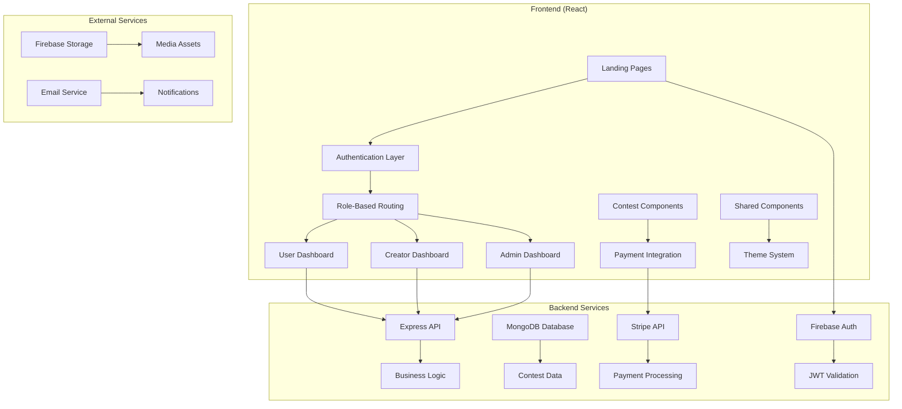

# Design Document

## Overview

Create Arena is a comprehensive contest-based web platform built with React, featuring role-based authentication, secure payment processing, and real-time competition management. The platform serves three distinct user types: Users (participants), Creators (contest hosts), and Admins (platform managers). This design document outlines the architecture, components, and implementation strategy for enhancing the existing platform to meet modern UI/UX standards and comprehensive functionality requirements.

The platform leverages React 19, Tailwind CSS with DaisyUI, Firebase authentication, Stripe payments, and TanStack Query for state management. The design emphasizes consistency, accessibility, and scalability while maintaining a clean, professional aesthetic across all user interfaces.

## Architecture

### High-Level Architecture



### Component Architecture

The application follows a hierarchical component structure with clear separation of concerns:

1. **Layout Components**: Handle page structure and navigation
2. **Feature Components**: Implement specific business logic (contests, payments, dashboards)
3. **Shared Components**: Reusable UI elements (cards, forms, modals)
4. **Context Providers**: Manage global state (authentication, theme, user data)

### State Management Strategy

- **Local State**: Component-specific UI state using React hooks
- **Global State**: Authentication and user context using React Context
- **Server State**: API data management using TanStack Query
- **Form State**: Form handling using React Hook Form
- **Theme State**: Dark/light mode using DaisyUI theme system

## Components and Interfaces

### Core Layout Components

#### Navigation System
```typescript
interface NavbarProps {
  isAuthenticated: boolean;
  userRole: 'user' | 'creator' | 'admin';
  currentTheme: 'light' | 'dark';
  onThemeToggle: () => void;
}

interface NavigationItem {
  label: string;
  path: string;
  icon: ReactNode;
  roles: UserRole[];
  isDropdown?: boolean;
  children?: NavigationItem[];
}
```

The navbar adapts based on authentication status and user role:
- **Logged Out**: Home, Contests, About, Login, Register
- **Logged In**: Home, Contests, Dashboard, Profile, Leaderboard, Logout
- **Advanced Menu**: Profile dropdown with settings, theme toggle, and role-specific options

#### Hero Section
```typescript
interface HeroSectionProps {
  title: string;
  subtitle: string;
  ctaText: string;
  ctaAction: () => void;
  backgroundImage?: string;
  animationType: 'slide' | 'fade' | 'zoom';
}
```

Height constrained to 60-70% viewport with interactive elements and smooth transitions to content sections.

### Contest Management Components

#### Contest Card System
```typescript
interface ContestCard {
  id: string;
  title: string;
  description: string;
  image: string;
  category: string;
  prize: number;
  deadline: Date;
  participantCount: number;
  difficulty: 'beginner' | 'intermediate' | 'advanced';
  status: 'upcoming' | 'active' | 'completed';
}

interface ContestGridProps {
  contests: ContestCard[];
  loading: boolean;
  viewMode: 'grid' | 'list';
  cardsPerRow: 4 | 3 | 2;
}
```

Consistent card design with:
- Fixed dimensions (aspect ratio 4:3)
- Uniform border radius (8px)
- Hover effects and transitions
- Skeleton loading states

#### Contest Details Interface
```typescript
interface ContestDetails {
  id: string;
  title: string;
  description: string;
  images: string[];
  rules: string[];
  prizes: Prize[];
  timeline: TimelineEvent[];
  requirements: string[];
  submissions: Submission[];
  leaderboard: LeaderboardEntry[];
}

interface ContestDetailsProps {
  contest: ContestDetails;
  userRole: UserRole;
  hasJoined: boolean;
  onJoin: (contestId: string) => void;
  onSubmit: (submission: Submission) => void;
}
```

### Search and Filtering System

#### Filter Interface
```typescript
interface FilterOptions {
  categories: string[];
  priceRange: [number, number];
  difficulty: string[];
  status: string[];
  dateRange: [Date, Date];
}

interface SearchAndFilterProps {
  onSearch: (query: string) => void;
  onFilter: (filters: FilterOptions) => void;
  onSort: (sortBy: string, order: 'asc' | 'desc') => void;
  totalResults: number;
  currentPage: number;
  totalPages: number;
}
```

Advanced filtering with:
- Real-time search with debouncing
- Multi-select category filters
- Price range sliders
- Date range pickers
- Sort options (newest, price, popularity, deadline)

### Dashboard Components

#### Role-Based Dashboard Layout
```typescript
interface DashboardLayoutProps {
  userRole: UserRole;
  sidebarItems: SidebarItem[];
  children: ReactNode;
}

interface SidebarItem {
  id: string;
  label: string;
  icon: ReactNode;
  path: string;
  badge?: number;
  subItems?: SidebarItem[];
}
```

#### Dashboard Widgets
```typescript
interface DashboardWidget {
  id: string;
  title: string;
  type: 'metric' | 'chart' | 'table' | 'list';
  data: any;
  size: 'small' | 'medium' | 'large';
  refreshInterval?: number;
}

interface MetricCardProps {
  title: string;
  value: number | string;
  change?: number;
  changeType?: 'increase' | 'decrease';
  icon: ReactNode;
  color: string;
}
```

Dynamic dashboard with:
- Real-time metrics cards
- Interactive charts (Chart.js/Recharts)
- Data tables with sorting/filtering
- Responsive grid layout

### Authentication Components

#### Authentication Forms
```typescript
interface AuthFormProps {
  type: 'login' | 'register';
  onSubmit: (data: AuthData) => void;
  loading: boolean;
  error?: string;
}

interface AuthData {
  email: string;
  password: string;
  confirmPassword?: string;
  firstName?: string;
  lastName?: string;
  role?: UserRole;
}
```

Features:
- Form validation with React Hook Form
- Social login integration (Google/Facebook)
- Demo login functionality
- Error handling and success states
- Password strength indicators

### Payment Integration Components

#### Payment Flow
```typescript
interface PaymentComponentProps {
  contestId: string;
  amount: number;
  onSuccess: (paymentId: string) => void;
  onCancel: () => void;
  onError: (error: string) => void;
}

interface PaymentHistory {
  id: string;
  contestId: string;
  contestTitle: string;
  amount: number;
  date: Date;
  status: 'completed' | 'pending' | 'failed' | 'refunded';
  paymentMethod: string;
}
```

Stripe integration with:
- Secure payment processing
- Payment status tracking
- Transaction history
- Refund handling
- Payment method management

## Data Models

### User Management
```typescript
interface User {
  id: string;
  email: string;
  firstName: string;
  lastName: string;
  avatar?: string;
  role: 'user' | 'creator' | 'admin';
  status: 'active' | 'suspended' | 'pending';
  createdAt: Date;
  lastLogin: Date;
  profile: UserProfile;
}

interface UserProfile {
  bio?: string;
  skills: string[];
  socialLinks: SocialLink[];
  achievements: Achievement[];
  statistics: UserStatistics;
}

interface UserStatistics {
  contestsJoined: number;
  contestsWon: number;
  totalEarnings: number;
  averageRating: number;
  contestsCreated?: number; // For creators
}
```

### Contest System
```typescript
interface Contest {
  id: string;
  title: string;
  description: string;
  category: string;
  images: string[];
  creatorId: string;
  rules: string[];
  requirements: string[];
  prizes: Prize[];
  timeline: {
    registrationStart: Date;
    registrationEnd: Date;
    contestStart: Date;
    contestEnd: Date;
    resultsAnnouncement: Date;
  };
  settings: ContestSettings;
  status: 'draft' | 'published' | 'active' | 'completed' | 'cancelled';
  participants: Participant[];
  submissions: Submission[];
  createdAt: Date;
  updatedAt: Date;
}

interface Prize {
  position: number;
  amount: number;
  description: string;
  type: 'cash' | 'product' | 'certificate';
}

interface ContestSettings {
  maxParticipants?: number;
  entryFee: number;
  difficulty: 'beginner' | 'intermediate' | 'advanced';
  isPublic: boolean;
  allowLateSubmissions: boolean;
  requireApproval: boolean;
}
```

### Submission and Evaluation
```typescript
interface Submission {
  id: string;
  contestId: string;
  userId: string;
  content: SubmissionContent;
  submittedAt: Date;
  status: 'pending' | 'approved' | 'rejected' | 'winner';
  score?: number;
  feedback?: string;
  evaluatedBy?: string;
  evaluatedAt?: Date;
}

interface SubmissionContent {
  type: 'text' | 'file' | 'url' | 'media';
  data: string;
  attachments?: FileAttachment[];
  metadata?: Record<string, any>;
}

interface Evaluation {
  submissionId: string;
  evaluatorId: string;
  criteria: EvaluationCriteria[];
  totalScore: number;
  feedback: string;
  createdAt: Date;
}

interface EvaluationCriteria {
  name: string;
  weight: number;
  score: number;
  maxScore: number;
  comments?: string;
}
```

### Payment and Transaction Management
```typescript
interface Payment {
  id: string;
  userId: string;
  contestId: string;
  amount: number;
  currency: string;
  stripePaymentIntentId: string;
  status: 'pending' | 'completed' | 'failed' | 'refunded';
  paymentMethod: PaymentMethod;
  createdAt: Date;
  completedAt?: Date;
  refundedAt?: Date;
  metadata?: Record<string, any>;
}

interface PaymentMethod {
  type: 'card' | 'bank_transfer' | 'digital_wallet';
  last4?: string;
  brand?: string;
  expiryMonth?: number;
  expiryYear?: number;
}
```

Now I need to use the prework tool to analyze the acceptance criteria before writing the correctness properties:

<function_calls>
<invoke name="prework">
<parameter name="featureName">contest-platform-enhancement

## Correctness Properties

*A property is a characteristic or behavior that should hold true across all valid executions of a system-essentially, a formal statement about what the system should do. Properties serve as the bridge between human-readable specifications and machine-verifiable correctness guarantees.*

Based on the prework analysis, the following properties ensure the Contest Platform meets its requirements:

### Design System Properties

**Property 1: Color Palette Constraint**
*For any* theme configuration, the total number of primary colors should not exceed 3, plus one optional neutral color
**Validates: Requirements 1.1**

**Property 2: Theme Contrast Compliance**
*For any* theme (light or dark), all color combinations should meet WCAG contrast ratio standards (4.5:1 for normal text, 3:1 for large text)
**Validates: Requirements 1.2, 15.5**

**Property 3: Layout Consistency**
*For any* page component, spacing and alignment values should conform to the defined design system tokens
**Validates: Requirements 1.3, 15.3**

**Property 4: Component Visual Uniformity**
*For any* set of cards or similar components, all instances should have identical dimensions, border radius, and base styling properties
**Validates: Requirements 1.4, 4.2, 4.3**

### Navigation and Responsiveness Properties

**Property 5: Navigation Route Count by Authentication State**
*For any* user authentication state, the navigation should display the minimum required routes (3 for logged out, 5 for logged in)
**Validates: Requirements 2.2, 2.3**

**Property 6: Responsive Layout Integrity**
*For any* viewport size (mobile, tablet, desktop), all components should maintain proper layout and functionality without horizontal scrolling or content overflow
**Validates: Requirements 1.6, 2.6, 14.5, 15.2**

**Property 7: Hero Section Height Constraint**
*For any* viewport, the hero section height should be between 60% and 70% of the screen height
**Validates: Requirements 3.1**

### Contest Display Properties

**Property 8: Contest Card Content Completeness**
*For any* contest card, it should contain all required elements: image, title, description, meta information, and "View Details" button
**Validates: Requirements 4.1**

**Property 9: Desktop Grid Layout**
*For any* desktop viewport (≥1024px), contest cards should display exactly 4 cards per row
**Validates: Requirements 4.4**

**Property 10: Loading State Display**
*For any* asynchronous data loading operation, skeleton loaders or loading indicators should be visible during the loading state
**Validates: Requirements 4.5, 15.6**

### Search and Filter Properties

**Property 11: Filter Functionality Coverage**
*For any* contest listing page, at least 2 filter fields (category, price, rating, date, location) should be available and functional
**Validates: Requirements 6.2**

**Property 12: Filter Result Accuracy**
*For any* applied filter combination, all returned results should match the specified filter criteria
**Validates: Requirements 6.5**

**Property 13: Sort Option Availability**
*For any* contest listing, multiple sort options should be available and correctly reorder the results
**Validates: Requirements 6.3**

### Authentication and Security Properties

**Property 14: Form Validation Completeness**
*For any* form submission with invalid data, appropriate validation errors should be displayed and submission should be prevented
**Validates: Requirements 1.5, 7.2**

**Property 15: JWT Security Implementation**
*For any* authenticated request, valid JWT tokens should be required and properly validated
**Validates: Requirements 7.6**

### Dashboard Properties

**Property 16: Role-Based Sidebar Navigation**
*For any* user role, the dashboard sidebar should display the minimum required menu items (2 for users, 3 for admins)
**Validates: Requirements 8.2, 8.3**

**Property 17: Dashboard Widget Data Binding**
*For any* dashboard metric card or chart, the displayed data should reflect real, current system data
**Validates: Requirements 8.4, 8.5**

**Property 18: Profile Edit Persistence**
*For any* profile information edit, changes should be saved and persist across sessions
**Validates: Requirements 8.7**

### Payment System Properties

**Property 19: Payment Integration Completeness**
*For any* contest with entry fee, Stripe payment integration should be available and functional
**Validates: Requirements 9.1**

**Property 20: Payment Flow State Handling**
*For any* payment attempt, the system should correctly handle and display success, failure, and cancellation states
**Validates: Requirements 9.2, 9.5**

**Property 21: Payment History Accuracy**
*For any* completed payment, the transaction should be recorded and displayed in the user's payment history
**Validates: Requirements 9.3**

### Contest Management Properties

**Property 22: Contest Lifecycle Management**
*For any* contest, status transitions should follow the defined lifecycle (draft → published → active → completed)
**Validates: Requirements 10.1, 10.5**

**Property 23: Submission System Functionality**
*For any* active contest, participants should be able to submit entries and creators should be able to review them
**Validates: Requirements 10.2, 10.3**

### Leaderboard Properties

**Property 24: Leaderboard Data Accuracy**
*For any* contest with submissions, the leaderboard should accurately reflect current rankings based on evaluation scores
**Validates: Requirements 11.1, 11.5**

**Property 25: Real-time Leaderboard Updates**
*For any* new submission or score update, the leaderboard should refresh to reflect the current state
**Validates: Requirements 11.2**

### Administrative Properties

**Property 26: Admin Access Control**
*For any* administrative operation, only users with admin role should have access
**Validates: Requirements 12.1, 12.5**

**Property 27: Creator Approval Workflow**
*For any* creator application, the approval workflow should track status and allow admin approval/rejection
**Validates: Requirements 12.3**

### Content and Link Properties

**Property 28: Content Quality Assurance**
*For any* production deployment, no lorem ipsum or placeholder text should be present
**Validates: Requirements 15.1**

**Property 29: Interactive Element Functionality**
*For any* button or link, clicking should trigger the expected action or navigation
**Validates: Requirements 14.2, 15.4**

**Property 30: Footer Consistency**
*For any* page, the footer should be present with consistent content and functionality
**Validates: Requirements 14.4**

## Error Handling

### Client-Side Error Handling

**Form Validation Errors**
- Real-time validation with immediate feedback
- Clear, actionable error messages
- Prevention of invalid form submissions
- Graceful handling of network timeouts

**Authentication Errors**
- Invalid credentials handling
- Session expiration management
- Social login failure recovery
- Account lockout notifications

**Payment Processing Errors**
- Stripe error code mapping to user-friendly messages
- Payment failure recovery options
- Transaction timeout handling
- Insufficient funds notifications

### Network and API Error Handling

**Connection Issues**
- Offline state detection and messaging
- Retry mechanisms for failed requests
- Graceful degradation of features
- Loading state management during retries

**Server Error Responses**
- 4xx client error handling with corrective guidance
- 5xx server error handling with retry options
- Rate limiting response handling
- Maintenance mode notifications

### Data Integrity Error Handling

**Contest Data Validation**
- Contest creation validation
- Submission format verification
- Deadline enforcement
- Participant limit validation

**User Data Protection**
- Profile update validation
- Role permission enforcement
- Data sanitization and validation
- Concurrent modification handling

## Testing Strategy

### Dual Testing Approach

The testing strategy employs both unit testing and property-based testing to ensure comprehensive coverage:

**Unit Tests**: Verify specific examples, edge cases, and error conditions
- Component rendering and interaction
- Form validation scenarios
- Authentication flow steps
- Payment processing states
- API integration points

**Property Tests**: Verify universal properties across all inputs
- Design system consistency across components
- Responsive behavior across viewport sizes
- Filter and search result accuracy
- Role-based access control enforcement
- Data validation and sanitization

### Property-Based Testing Configuration

**Testing Framework**: Fast-check for JavaScript/TypeScript property-based testing
**Test Configuration**:
- Minimum 100 iterations per property test
- Each property test references its design document property
- Tag format: **Feature: contest-platform-enhancement, Property {number}: {property_text}**

**Example Property Test Structure**:
```typescript
// Feature: contest-platform-enhancement, Property 4: Component Visual Uniformity
test('all contest cards have identical dimensions', () => {
  fc.assert(fc.property(
    fc.array(contestCardGenerator, { minLength: 2, maxLength: 20 }),
    (cards) => {
      const renderedCards = cards.map(renderContestCard);
      const dimensions = renderedCards.map(getDimensions);
      return allDimensionsEqual(dimensions);
    }
  ), { numRuns: 100 });
});
```

### Testing Coverage Areas

**Visual Consistency Testing**
- Component dimension uniformity
- Color palette compliance
- Spacing and alignment consistency
- Responsive layout integrity

**Functional Testing**
- Authentication flows
- Payment processing
- Contest management workflows
- Search and filtering accuracy
- Role-based access control

**Integration Testing**
- API endpoint integration
- Database operations
- Third-party service integration (Stripe, Firebase)
- Real-time data synchronization

**Performance Testing**
- Page load times
- Image optimization
- Bundle size optimization
- Database query performance

### Test Data Management

**Mock Data Generation**
- Realistic contest data generation
- User profile variations
- Payment transaction scenarios
- Submission content types

**Test Environment Setup**
- Isolated test database
- Mock payment processing
- Controlled authentication states
- Reproducible test scenarios

The testing strategy ensures that both specific functionality works correctly (unit tests) and that universal properties hold across all possible inputs (property tests), providing comprehensive validation of the Contest Platform's correctness and reliability.